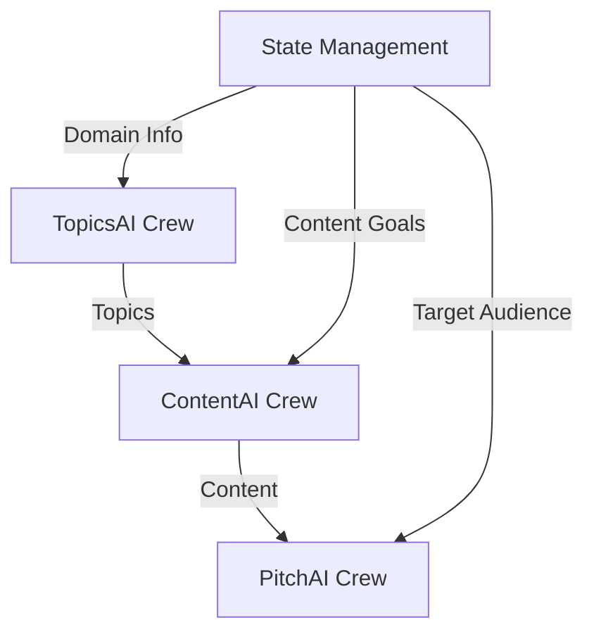

# Vertical Labs Multi-Agent System

A multi-agentic system using CrewAI Flows for generating topics, creating pitches, and producing content at scale. Features sequential and parallel execution, state management, and flow visualization.

## Overview

The system uses CrewAI Flows to orchestrate three specialized crews in a coordinated workflow:

1. **TopicsAI Crew** (First Stage)
   - Generates relevant topics for publishers
   - Analyzes trends and audience needs
   - Ensures topic diversity and quality
   - Agents:
     - Topic Researcher
     - Audience Analyst
     - Content Strategist
     - SEO Specialist
     - Quality Assurer
     - Topic Coordinator

2. **ContentAI Crew** (Second Stage)
   - Produces high-quality content for each topic
   - Ensures editorial standards
   - Optimizes for engagement
   - Agents:
     - Content Researcher
     - Content Writer
     - Content Editor
     - Content Optimizer
     - Content Coordinator

3. **PitchAI Crew** (Third Stage)
   - Creates compelling PR pitches for content
   - Matches content with publishers
   - Optimizes pitches for success
   - Agents:
     - Brand Analyst
     - Pitch Writer
     - Media Relations Specialist
     - Pitch Coordinator

## Flow Architecture

The system uses CrewAI's Flow pattern to manage the interaction between crews:



Key Features:
- Centralized state management using Pydantic models
- Sequential execution with data dependencies
- Parallel content generation for multiple topics
- Flow visualization for monitoring and debugging

## Configuration

Create a `.env` file with the following variables:

```env
OPENAI_API_KEY=your_openai_api_key
OPENAI_MODEL_NAME=gpt-4o
APIFY_API_TOKEN=your_apify_token
DATAFORSEO_LOGIN=your_dataforseo_login
DATAFORSEO_PASSWORD=your_dataforseo_password
DIFFBOT_API_KEY=your_diffbot_key
```

## Usage

### Basic Usage

```python
from vertical_labs.flow import kickoff, plot

# Define your inputs
domain = "Enterprise AI Solutions"
target_audience = """
    B2B audience including CTOs, Tech Leaders, and Developers
    in Software and AI/ML industries, primarily in USA and Canada.
    Looking for professional, analytical content with data-backed insights.
"""
content_goals = """
    Create thought leadership and technical analysis content that:
    - Demonstrates expertise in enterprise-grade AI solutions
    - Includes case studies and ROI metrics
    - Maintains professional tone and analytical style
    - Targets content length of 1000-1500 words
    - Emphasizes human-centric design in AI implementations
"""

# Run the flow
results = kickoff(
    domain=domain,
    target_audience=target_audience,
    content_goals=content_goals
)

# Access results
print(f"Topics Generated: {len(results.topics)}")
print(f"Content Pieces: {len(results.content_items)}")
print(f"Pitches Created: {len(results.pitches)}")

# Visualize the flow
plot()
```

### Installation

Ensure you have Python >=3.10 <=3.13 installed on your system. First, if you haven't already, install CrewAI:

```bash
pip install crewai
```

Next, navigate to your project directory and install the dependencies:

```bash
crewai install
```

### Running the Project

To kickstart your crew of AI agents and begin task execution, run this from the root folder:

```bash
crewai flow kickoff
```

To visualize the flow structure:

```bash
crewai flow plot
```

### Flow State

The system uses Pydantic models to manage state:

```python
class Topic(BaseModel):
    title: str
    description: str
    keywords: List[str]

class ContentItem(BaseModel):
    title: str
    content: str
    metadata: dict

class Pitch(BaseModel):
    title: str
    pitch: str
    target_audience: str

class VerticalLabsState(BaseModel):
    topics: List[Topic] = []
    content_items: List[ContentItem] = []
    pitches: List[Pitch] = []
    domain: str = ""
    target_audience: str = ""
    content_goals: str = ""
```

## Architecture

The system uses a flow-based architecture with these components:

1. **Flow Manager**: Coordinates the execution sequence and state management
   - Handles data flow between crews
   - Manages shared state using Pydantic models
   - Provides flow visualization
   - Supports parallel execution where possible

2. **Crews**: Specialized teams with specific responsibilities
   - TopicsAI: First stage, generates topics
   - ContentAI: Second stage, creates content
   - PitchAI: Third stage, develops pitches
   - Each crew operates independently but shares state

3. **Agents**: Individual AI agents with specific roles
   - Each agent has a defined responsibility
   - Agents communicate within their crew
   - Access to shared tools and resources

4. **Tools**: Shared utilities across crews
   - Each tool serves a specific purpose
   - Tools can be used by any agent
   - Results are stored in shared state

## Tools

- **News Tools**
  - TwitterTrendsTool: Fetches trending topics
  - NewsScraperTool: Gathers news articles
  - GoogleNewsTool: Searches Google News

- **Content Tools**
  - WebsiteAnalyzerTool: Analyzes website content
  - EditorialGuidelinesTool: Manages content guidelines
  - ContentDiversityTool: Ensures content variety

- **Pitch Tools**
  - PitchGeneratorTool: Creates PR pitches
  - BrandMatchingTool: Matches brands with opportunities
  - PitchOptimizationTool: Optimizes pitch success

## Advanced Features

### Flow Execution

The system supports both sequential and parallel execution:

```python
from vertical_labs.flow import VerticalLabsFlow

# Create a custom flow
class CustomFlow(VerticalLabsFlow):
    @start()
    def discover_topics(self):
        return TopicsCrew().crew().kickoff(inputs={
            "domain": self.state.domain
        })

    @listen(discover_topics)
    async def generate_content(self):
        tasks = []
        for topic in self.state.topics:
            # Content generation runs in parallel
            task = ContentCrew().crew().kickoff(inputs={
                "topic": topic.title,
                "content_goals": self.state.content_goals
            })
            tasks.append(task)
        return await asyncio.gather(*tasks)

    @listen(generate_content)
    def create_pitches(self):
        return PitchCrew().crew().kickoff(inputs={
            "content": self.state.content_items,
            "target_audience": self.state.target_audience
        })

# Run the flow
flow = CustomFlow()
flow.kickoff()
```

### Flow Monitoring

Monitor flow execution and visualize the process:

```python
from vertical_labs.flow import VerticalLabsFlow

# Enable detailed logging
flow = VerticalLabsFlow(verbose=True)

# Run with monitoring
results = flow.kickoff()

# Generate flow visualization
flow.plot()

# Get execution metrics
metrics = flow.get_metrics()
print(f"Total Execution Time: {metrics.total_time}")
print(f"Topics Generated: {len(results.topics)}")
print(f"Success Rate: {metrics.success_rate}%")
```

### State Management

The flow maintains state throughout execution:

```python
from vertical_labs.flow import VerticalLabsFlow

class CustomFlow(VerticalLabsFlow):
    def __init__(self):
        # Initialize with custom state
        super().__init__(
            initial_state=VerticalLabsState(
                domain="AI Technology",
                target_audience="Enterprise CTOs",
                content_goals="Technical deep dives"
            )
        )
    
    @start()
    def begin_flow(self):
        # Access state anywhere in the flow
        print(f"Starting flow for domain: {self.state.domain}")
        
        # Update state as needed
        self.state.topics.append(Topic(
            title="AI Trends 2024",
            description="Analysis of emerging AI trends",
            keywords=["AI", "trends", "2024"]
        ))
        
        return self.state.topics
```

## Testing

Run the test suite:

```bash
# Install test dependencies
poetry install --with=dev

# Run tests
pytest tests/
```

## Contributing

1. Fork the repository
2. Create a feature branch
3. Commit your changes
4. Push to the branch
5. Create a Pull Request

## License

MIT License
