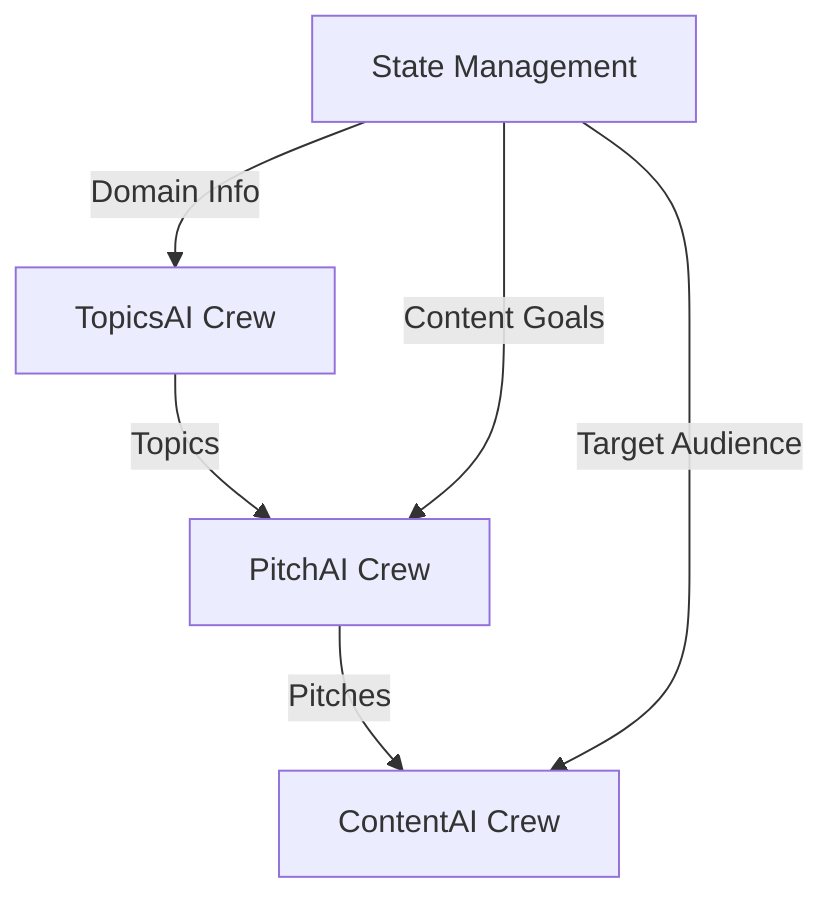

# Vertical Labs Multi-Agent System

A multi-agent content generation system using CrewAI Flows and Streamlit. This system automates the process of analyzing publishers, generating topics, developing pitches, and creating content through a coordinated workflow of specialized AI agents.

## Overview



The system consists of a Streamlit dashboard interface and three specialized CrewAI crews working in sequence:

1. **TopicsAI Crew** (First Stage)
   - Analyzes publisher websites to understand content strategy
   - Generates relevant topics based on publisher analysis
   - Ensures topic diversity and quality
   - Agents:
     - Website Analysis Expert: Analyzes publisher content strategy
     - Topic Research Specialist: Investigates trends and opportunities
     - Audience Analysis Expert: Analyzes audience preferences
     - Content Strategy Specialist: Develops content guidelines
     - Quality Assurance Specialist: Ensures topic diversity
     - Topic Coordination Manager: Oversees topic generation

2. **PitchAI Crew** (Second Stage)
   - Develops targeted pitches for selected topics
   - Optimizes for publisher preferences
   - Ensures strategic alignment
   - Agents:
     - Brand Analysis Specialist: Analyzes brand-publisher fit
     - Pitch Writing Expert: Creates compelling pitches
     - Media Relations Specialist: Optimizes publisher alignment
     - Pitch Coordination Manager: Oversees pitch delivery

3. **ContentAI Crew** (Third Stage)
   - Creates high-quality content for approved pitches
   - Maintains editorial standards and brand voice
   - Optimizes content for engagement
   - Agents:
     - Content Researcher: Gathers topic information
     - Content Writer: Creates engaging content
     - Content Editor: Ensures quality and accuracy
     - Content Optimizer: Enhances content impact
     - Content Coordinator: Manages content workflow

## Features

- **Interactive Dashboard**
  - Step-by-step workflow visualization
  - Real-time progress tracking
  - Agent conversation monitoring
  - Topic and pitch selection interface

- **Publisher Analysis**
  - Website content analysis
  - Audience targeting
  - Content strategy evaluation
  - Geographic coverage assessment

- **Topic Generation**
  - Trend analysis
  - Keyword research
  - Content gap identification
  - Quality assurance checks

- **Pitch Development**
  - Brand-publisher matching
  - Pitch optimization
  - Media relations insights
  - Delivery scheduling

- **Content Creation**
  - Research-driven content
  - Editorial guidelines compliance
  - SEO optimization
  - Quality control

## Installation

Ensure you have Python >=3.10 <=3.13 installed on your system.

1. Clone the repository:

```bash
git clone [repository-url]
cd multi-agent-system
```

2. Create and activate a virtual environment:

```bash
python -m venv venv
source venv/bin/activate  # On Windows: venv\Scripts\activate
```

3. Install dependencies:

```bash
pip install -r requirements.txt
```

## Configuration

Create a `.env` file in the project root with your API keys:

```env
OPENAI_API_KEY=your_openai_api_key
OPENAI_MODEL_NAME=gpt-4
APIFY_API_TOKEN=your_apify_token
DATAFORSEO_LOGIN=your_dataforseo_login
DATAFORSEO_PASSWORD=your_dataforseo_password
DIFFBOT_API_KEY=your_diffbot_key
```

## Usage

### Running the Dashboard

Start the Streamlit dashboard:

```bash
streamlit run src/vertical_labs/app.py
```

The dashboard provides a four-step workflow:

1. Publisher Analysis: Enter publisher details
2. Topic Selection: Choose topics to develop
3. Pitch Selection: Select pitches to create
4. Content Generation: View generated content

### Programmatic Usage

```python
from vertical_labs.main import kickoff

# Run the flow
results = kickoff(
    publisher_name="TechCrunch",
    publisher_url="https://techcrunch.com",
    publisher_categories=["Technology", "Startups", "AI/ML"],
    publisher_audience="Tech professionals, entrepreneurs",
    publisher_locations=["Global", "USA"],
    domain="Enterprise AI Solutions",
    target_audience="B2B audience including CTOs, Tech Leaders",
    content_goals="""
    Create thought leadership content that:
    - Demonstrates expertise in AI solutions
    - Includes case studies and metrics
    - Maintains professional tone
    """
)

# Access results
print(f"Topics Generated: {len(results.topics)}")
print(f"Pitches Created: {len(results.pitches)}")
print(f"Content Pieces: {len(results.content_items)}")
```

## Architecture

The system uses a flow-based architecture with these key components:

1. **Flow Manager**
   - Coordinates crew execution sequence
   - Manages state using Pydantic models
   - Handles data flow between crews
   - Provides progress tracking

2. **Streamlit Dashboard**
   - User interface for system interaction
   - Real-time progress visualization
   - Agent conversation display
   - Result presentation

3. **Specialized Crews**
   - TopicsAI: Publisher analysis and topic generation
   - PitchAI: Pitch development and optimization
   - ContentAI: Content creation and refinement

4. **State Management**
   - Pydantic models for data validation
   - Centralized state tracking
   - Inter-crew data sharing
   - Progress monitoring

## Data Models

```python
class Topic(BaseModel):
    title: str
    description: str
    keywords: List[str]

class Pitch(BaseModel):
    title: str
    pitch: str
    target_audience: str

class ContentItem(BaseModel):
    title: str
    content: str
    metadata: Dict

class PublisherInfo(BaseModel):
    name: str
    url: str
    categories: List[str]
    audience: str
    locations: List[str]
    preferences: Optional[Dict] = {}
```

## Contributing

1. Fork the repository
2. Create a feature branch
3. Commit your changes
4. Push to the branch
5. Create a Pull Request

## License

MIT License

## Support

For support, please open an issue in the GitHub repository or contact the development team.
